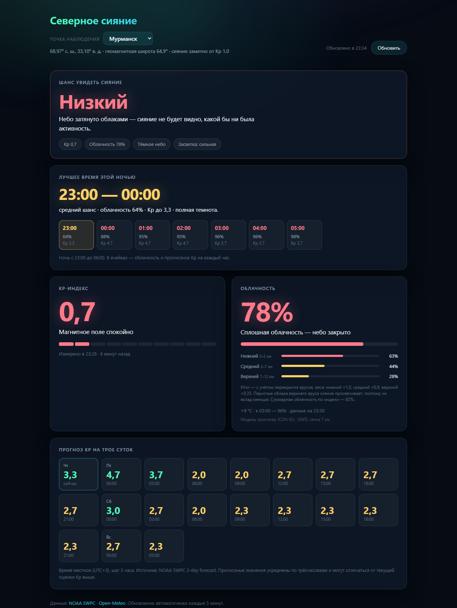

# Северное сияние — Мурманская область

Дашборд прогноза северного сияния для семи точек Мурманской области: текущий Kp-индекс, облачность по ярусам, оценка шанса увидеть сияние и лучшее время для наблюдения ближайшей ночью.

**[Открыть живую версию →](https://auroramurmansk.ru/)**



HTML, CSS и чистый JavaScript. Без фреймворков, без сборки, без зависимостей — три файла и браузер.

## Запуск

Двойной клик по `index.html` обычно работает: оба API отдают `Access-Control-Allow-Origin: *`. Если браузер всё же заблокирует запросы со страницы, открытой по `file://`, поднимите локальный сервер:

```bash
python -m http.server 8765
```

и откройте `http://localhost:8765`.

## Что показывает

Три вкладки: **«Сейчас»** — условия в выбранной точке, **«Куда ехать ночью»** — сравнение всех семи точек на ближайшую ночь, **«Уведомления»** — проверка и настройка уведомлений. Вкладка запоминается и отражается в адресе (`#now`, `#tonight`, `#notify`), так что ссылкой можно поделиться. На широком экране навигация сверху, на узком — внизу экрана.

Вкладка «Сейчас»:

| Блок | Содержимое |
|---|---|
| Шанс увидеть сияние | Низкий / средний / высокий на текущий момент, пояснение и список учтённых факторов |
| Лучшее время этой ночью | Окно наблюдения и почасовая раскладка ближайшей ночи |
| Kp-индекс | Текущее значение, шкала 0–9, время измерения |
| Облачность | Эффективная облачность, разбивка по трём ярусам, температура |
| Прогноз Kp | Трое суток с шагом 3 часа, текущая трёхчасовка подсвечена |

Вкладка «Куда ехать ночью»:

| Блок | Содержимое |
|---|---|
| Ответ | Лучшая точка и её окно наблюдения — либо прямое «ехать некуда» |
| Список точек | Все семь по убыванию оценки: окно, облачность, порог Kp, расстояние и время в пути |

Облачность для всех семи точек запрашивается **одним** запросом к Open-Meteo: API принимает список координат через запятую и возвращает массив в том же порядке. Kp и его прогноз переиспользуются с первой вкладки — это планетарные величины, одинаковые для всей области.

Данные второй вкладки грузятся при первом её открытии, а не при старте приложения, и кэшируются на тех же правилах, что остальные: три часа, пометка возраста при показе из кэша.

Если ни в одной точке условия не дотягивают до среднего, в ответе так и написано — «ехать некуда», с указанием причины. Лучшее из плохого в крупной строке не показывается, но список ниже остаётся полным: по нему видно основание для вывода.

## Точки наблюдения

Точка выбирается в шапке, выбор сохраняется в браузере. Координаты проверены по открытому геокодеру Open-Meteo (данные GeoNames), геомагнитная широта посчитана дипольным приближением IGRF для эпохи ~2025 (полюс 80.7° с. ш., 72.7° з. д.):

```
sin(φm) = sin(φ)·sin(φp) + cos(φ)·cos(φp)·cos(λ − λp)
```

| Точка | Широта | Долгота | Геомагн. широта | Засветка | Сияние заметно от Kp |
|---|---|---|---|---|---|
| Мурманск | 68.9678 | 33.0992 | 64,87 | сильная | 1,0 |
| Териберка | 69.1609 | 35.1453 | 64,78 | минимальная | 1,1 |
| Мончегорск | 67.9397 | 32.8739 | 63,94 | заметная | 1,5 |
| Ловозеро | 68.0056 | 35.0187 | 63,72 | слабая | 1,6 |
| Кировск | 67.6148 | 33.6727 | 63,53 | заметная | 1,7 |
| Апатиты | 67.5827 | 33.4134 | 63,53 | заметная | 1,7 |
| Кандалакша | 67.1512 | 32.4128 | 63,26 | заметная | 1,8 |

Деталь, которую видно только из этой таблицы: **Териберка географически севернее Мурманска, а геомагнитно — южнее**. Геомагнитная сетка наклонена, и Териберка лежит восточнее. Её преимущество перед городом не в широте, а в отсутствии засветки.

Оговорка: дипольное приближение — не строгая скорректированная геомагнитная широта (CGM), которой пользуются в авроральной науке. В этом регионе расхождение до полуградуса, то есть до четверти единицы Kp — меньше шага самих данных NOAA.

## Как считается оценка

**Kp.** Пороги занижены относительно привычных: вся область лежит практически под авроральным овалом, и сияние здесь возможно уже при Kp 2, тогда как в средней полосе нужен Kp 5–6.

Экваториальная граница овала опускается примерно на 2° геомагнитной широты на каждую единицу Kp, то есть овал оказывается над головой при `Kp ≈ (67° − φm) / 2`. Для Мурманска это ≈ 1,1, и пороги 1 / 2 / 3, подобранные под него, уже это отражают. Поэтому шкала не считается заново для каждой точки, а якорится на Мурманск и сдвигается:

```
сдвиг = (φm Мурманска − φm точки) / 2
порог = порог Мурманска + сдвиг
```

| Kp относительно порогов точки | Балл |
|---|---|
| ≥ верхнего | 3 |
| ≥ среднего | 2 |
| ≥ нижнего | 1 |
| ниже | 0 |

Практический смысл: при типичном Kp 2,67 Мурманск получает балл 2, а Кандалакша — 1. Разница почти в целую единицу Kp между крайними точками соответствует 200 км по меридиану.

**Засветка** в расчёт не входит намеренно: это не прогнозируемая величина, а свойство места, и смешивать её с погодой в одной формуле значило бы выдавать за прогноз то, что прогнозом не является. Она появляется в списке факторов и в пояснении к вердикту — например, для Мурманска советом отъехать на 15–20 км от огней.

**Облачность.** Сияние светится на высоте 100–300 км, выше любых облаков, поэтому важна только прозрачность слоя:

| Ярус | Высота | Типичные облака | Вес |
|---|---|---|---|
| Нижний | 0–2 км | Stratus, stratocumulus | 1,0 |
| Средний | 2–7 км | Altostratus, altocumulus | 0,8 |
| Верхний | 7–12 км | Cirrus, cirrostratus | 0,35 |

Ярусы сводятся в одно число по модели случайного перекрытия:

```
итог = 1 − (1 − low) · (1 − 0,8·mid) · (1 − 0,35·high)
```

Простое сложение процентов дважды учитывает перекрытие слоёв. Сравнение на 9261 сочетании с шагом 5 % показало, что сумма упирается в потолок 100 % на 57 % пространства значений и в 19 % сочетаний объявляет небо закрытым там, где модель перекрытия видит просветы. На сплошных ярусах обе формулы совпадают тождественно.

Пороги балла: ≤ 25 % — ясно (3), ≤ 50 % — переменная облачность (2), ≤ 75 % — просветы редки (1), выше — небо закрыто (0).

**Итог** — произведение баллов: ≥ 6 высокий, ≥ 2 средний, иначе низкий.

**Высота Солнца** считается локально для координат выбранной точки, без запросов к API. С мая по июль здесь полярный день, и при любом Kp и чистом небе сияние не видно, поэтому светлое небо принудительно опускает вердикт до низкого.

## Окно наблюдения

Вердикт относится к текущему моменту, а планировать поездку нужно на ночь, поэтому дашборд отдельно считает лучшее время ближайшей ночи. Новых запросов для этого не нужно — всё уже загружено:

- почасовая облачность по ярусам на 48 часов вперёд;
- прогноз Kp с шагом 3 часа;
- высота Солнца, которая считается локально для каждого часа.

Ночью считается ближайший непрерывный отрезок часов, когда Солнце ниже −6°. Каждому часу присваивается тот же уровень, что и вердикту: произведение баллов за Kp и облачность, с понижением до среднего, если темнота неполная (Солнце выше −12°). Окно — самый длинный непрерывный ряд часов с максимальным уровнем.

Под окном выводится вся ночь по часам с облачностью и прогнозным Kp — видно не только «когда лучше», но и почему именно тогда.

В полярный день тёмных часов не находится, и карточка честно сообщает, что темноты не будет.

## Почему выбрана эта модель прогноза

Дашборд запрашивает у Open-Meteo не суммарную облачность, а три яруса по отдельности — и при проверке выяснилось, что этим полям можно верить не у всякой модели.

Исходное наблюдение: при ярусах 6 / 3 / 0 (практически чистое небо) API отдавал суммарную облачность 62 %. Это противоречие, а не округление: при **любом** допущении о перекрытии слоёв суммарная облачность обязана лежать между максимумом яруса и суммой ярусов.

```
max(ярусы) ≤ всего ≤ min(100, сумма ярусов)
```

Проверка двенадцати моделей на 48 часах почасового ряда (17 сентября 2026, точка 68.97 / 33.07):

| Модель | Часов с нарушением неравенства | Расхождение > 30 п.п. | Среднее расхождение |
|---|---|---|---|
| `best_match` | 16 из 48 (33 %) | 23 % часов | 17 п.п. |
| `metno_seamless` | 16 из 48 (33 %) | 23 % часов | 17 п.п. |
| **`icon_eu`** | **0** | **0** | **2 п.п.** |
| `ecmwf_ifs025` | 12 (25 %) | 0 | 8 п.п. |
| `gfs_seamless` | 1 (2 %) | 0 | 1 п.п. |

Что из этого следует:

1. **`best_match` для Мурманска — это MET Norway.** Ответы `best_match` и `metno_seamless` совпали до единицы во всех четырёх полях и на всех 48 часах.
2. **У MET Norway ярусы и сумма несогласованы систематически.** Самый наглядный час: ярусы 8 / 4 / 0 при суммарной облачности 90 % — «почти ясно» и «почти сплошь» одновременно.
3. **Недостоверными выглядят ярусы, а не сумма.** С суммарными 72 % независимо согласились `icon_eu` и `gfs_seamless`, а ярусы 8 / 13 / 0 разделили только `knmi_seamless` и `dmi_seamless` — сборки, которые, судя по совпадению значений до единицы, берут их из общего источника.
4. **Расчёт по ярусам MET Norway занижал облачность.** Дашборд показывал «ясно, 18 %» в момент, когда три модели из четырёх видели 70 % и больше. После переключения на ICON-EU в тот же момент: ярусы 60 / 50 / 22, эффективная облачность 78 % при суммарной 81 %.

Поэтому модель указывается явно (`models=icon_eu`), а не отдаётся на автовыбор. ICON-EU грубее локальной скандинавской модели — сетка 7 км против ~1 км, — но её поля самосогласованы, а для расчёта по ярусам это важнее разрешения.

Название действующей модели выведено в карточке облачности, чтобы подмена источника не прошла незаметно. Модель меняется одним значением `CONFIG.weatherModel` в [`app.js`](app.js).

**Страховка.** Если оценка по ярусам и суммарная облачность всё же разойдутся больше чем на 30 процентных пунктов, в карточке появится предупреждение «данные об облачности противоречивы», а балл за облачность будет ограничен: высокий при недостоверных данных не ставится.

## Устойчивость к отказам

- Таймаут 12 секунд и одна автоматическая повторная попытка на каждый запрос.
- Три запроса независимы: падение NOAA не ломает блок погоды и наоборот.
- Последний удачный ответ каждого API сохраняется в `localStorage`. При отказе показываются сохранённые данные приглушённо, с пометкой «данные 12 минут назад» и кнопкой «Повторить». Старше трёх часов не показываются вовсе.
- Вся работа с хранилищем обёрнута в `try/catch`: в приватном режиме обращение к `localStorage` бросает исключение, при переполнении квоты падает запись. Кэш необязателен — без него дашборд работает как раньше.
- Вердикт считается и на неполных данных, с явной пометкой о неполноте.
- Автообновление раз в 5 минут плюс догоняющее обновление при возврате на вкладку.

## Структура

```
index.html      разметка: вердикт, окно наблюдения, Kp, облачность, прогноз
styles.css      тёмная «полярная» тема, адаптив до 375 px
app.js          загрузка данных, расчёт оценки, рендер, кэш, обработка ошибок
manifest.json   манифест PWA
sw.js           service worker: кэш оболочки приложения
icons/          иконки 192, 512 и maskable
tools/          скрипты, которыми проверялся выбор метеомодели и формулы
```

Папка `tools/` — одноразовые проверки на Node.js, к странице отношения не имеют; подробности в [tools/README.md](tools/README.md).

## Уведомления о высоком шансе

Под вердиктом есть кнопка «Сообщить о высоком шансе». Разрешение браузер спрашивает только по её нажатию, после согласия приходит пробное уведомление — сразу видно, что система их пропускает. Повторное нажатие выключает.

Уведомление приходит, когда вердикт выбранной точки **переходит** в «Высокий», а не на каждом обновлении, пока он держится. Дополнительные правила:

- не чаще раза в 3 часа на точку: суббури идут волнами с таким интервалом, и сигнал на каждую волну был бы шумом;
- не приходит, если вкладка в фокусе — вердикт и так перед глазами;
- не приходит по сохранённым данным из кэша: устаревший «высокий» — не повод будить;
- первый свежий расчёт после открытия или смены точки служит только точкой отсчёта.

На вкладке **«Уведомления»** можно проверить, что всё работает. Пошаговая проверка показывает, где именно проблема: поддерживает ли браузер уведомления, выдано ли разрешение сайту, активен ли service worker, включены ли уведомления о высоком шансе и открыто ли приложение как установленное (на iPhone без этого не работает). Кнопка «Отправить пробное» шлёт уведомление сразу, «Через 10 секунд» — с задержкой, чтобы успеть свернуть приложение и проверить главный сценарий: придёт ли уведомление в фоне. Ниже — памятка, что делать, если не пришло, для Chrome и Edge, Windows, macOS, Android и iPhone.

Уведомления показываются через service worker — на Android обычный конструктор `new Notification()` не работает. Нажатие на уведомление открывает приложение или возвращает фокус уже открытому.

**Ограничение.** У сайта нет сервера push-уведомлений, поэтому закрытая страница проснуться не может: уведомления работают, пока приложение открыто — во вкладке, в том числе фоновой, или в установленном окне. На телефоне система обычно приостанавливает свёрнутое приложение, так что там это скорее сигнал, пока экран не погас. На iPhone уведомления доступны только в приложении, добавленном на экран «Домой».

## Установка как приложение

Дашборд — PWA: в Chrome и Edge его можно установить с панели адреса, на Android — «Добавить на главный экран», на iOS — «Поделиться» → «На экран «Домой»». Запускается в отдельном окне без адресной строки, с тёмной темой системных панелей.

Service worker кэширует только оболочку приложения — `index.html`, `styles.css`, `app.js`, манифест и иконки — по стратегии cache-first. Запросы к NOAA и Open-Meteo не кэшируются вообще и всегда идут в сеть: их свежесть обеспечивает `localStorage` со своей отсечкой в три часа и пометкой возраста, а два кэша с разными правилами устаревания давали бы противоречивые показания.

Без сети дашборд открывается из кэша и показывает последние сохранённые данные приглушённо, с подписью вроде «Данные 8 минут назад» на каждой карточке.

Имя кэша версионировано (`aurora-v1`). При изменении файлов оболочки версия поднимается: `install` перезагружает файлы, минуя HTTP-кэш, `activate` удаляет предыдущую версию. Плата за cache-first — обновление применяется со следующего открытия приложения, а не в текущем сеансе.

## Источники данных

- [NOAA SWPC](https://www.swpc.noaa.gov/) — Kp-индекс (поминутный ряд, трёхчасовой как резервный) и прогноз на трое суток.
- [Open-Meteo](https://open-meteo.com/) — облачность по ярусам и температура, модель ICON-EU.

Оба API публичные, без ключей и регистрации.

## Ограничения

Оценка ориентировочная. Не учитываются засветка города, туман, локальные разрывы облаков и фаза Луны. Kp — трёхчасовое усреднение, оно запаздывает относительно реальной активности; южная компонента межпланетного магнитного поля (Bz) показала бы вспышку раньше, но пока не подключена.

Окно наблюдения ограничено горизонтом почасового прогноза в 48 часов и наследует его точность: прогноз облачности на вторую ночь заметно менее надёжен, чем на ближайшую.

## Лицензия

[MIT](LICENSE) © 2026 Ilya Minichev
